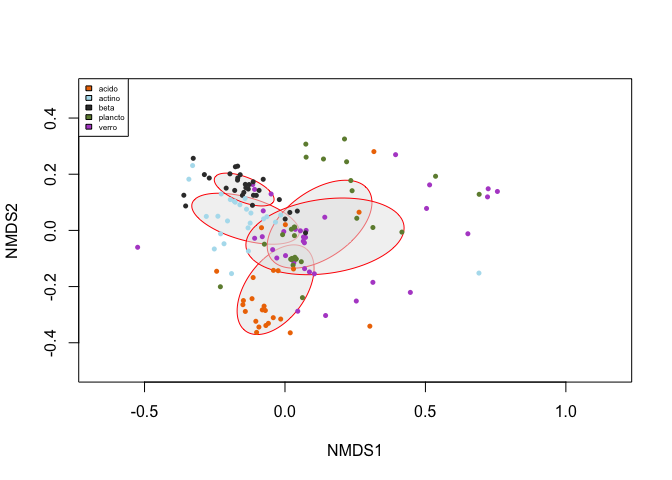
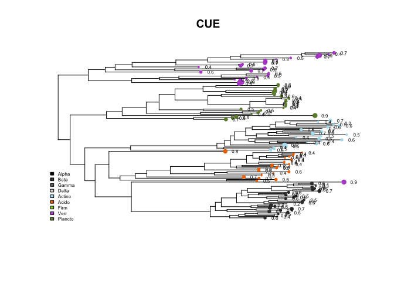
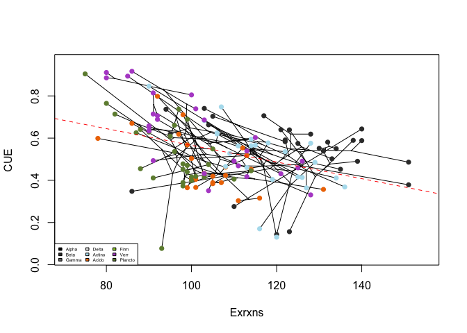
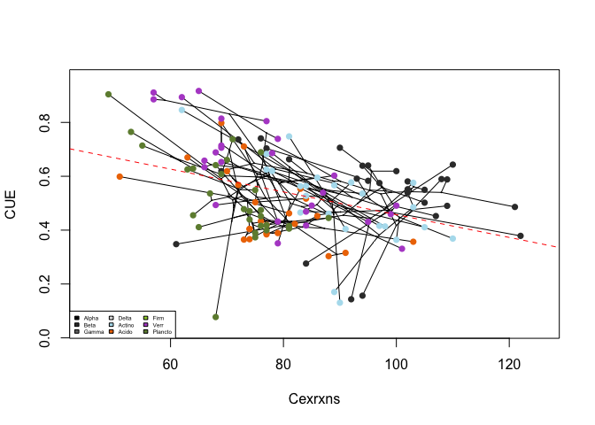
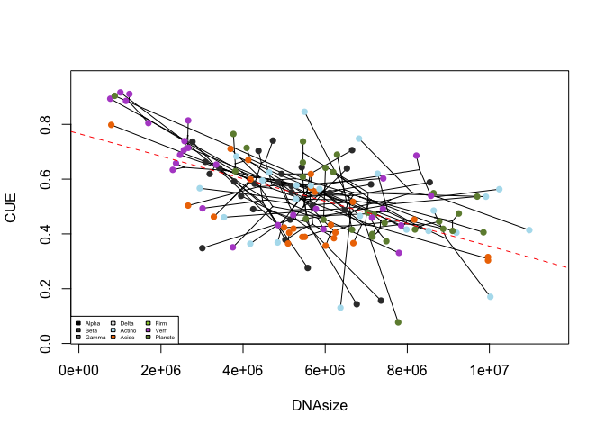
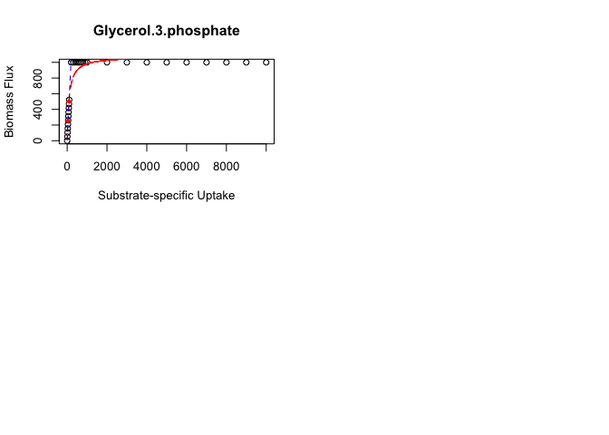

# CUE Working Summary
Mustafa  

**CONTENTS** 

[1. Downloading Summary](#1)

[2. Carbon Use Efficiency](#2)

>[2a. Unconstrained CUE](#2a)

>>[Phylogenetic Analysis](#2a1)

>[2b. Constrained CUE](#2b)

>>[Uptake Kinetics](#2b1)

>>[Effect Sizes](#2b2) 


#1 
#**Downloading Summary**

The DOE knowledgebase (kBASE) was searched for genomes from six major phyla found in soil microbial communities. A total of 24,268 genomes were found to correspond to the six major phyla. Results were trimmed to eliminate duplicates within a given genus, resulting in 1,082 unique genera. These genera were searched in the primary literature to determine habitat preference, and eliminate non-soil bacterial species. Ultimately, 231 species were selected for analysis.


|        | Genomes| Genera| Selections|
|:-------|-------:|------:|----------:|
|Alpha   |    1709|    197|         32|
|Beta    |    1092|    114|         30|
|Gamma   |    7731|    240|         19|
|Delta   |     185|     56|         10|
|Actino  |    4055|    191|         25|
|Acido   |      25|     12|         25|
|Firm    |    8668|    233|         25|
|Verr    |      36|      9|         36|
|Plancto |      29|     12|         29|

*Note: most of the subsequent analyses currently include only Actino, Acido, Verr, Plancto and Betaproteobacteria.*


A database of exchange reactions was built to represent the full range of metabolites possible for uptake across all models. Models were compared for similarity of exchange reaction identity using MDS ordination.


```
## Run 0 stress 0.193728 
## Run 1 stress 0.1916959 
## ... New best solution
## ... procrustes: rmse 0.01880379  max resid 0.1134417 
## Run 2 stress 0.1930628 
## Run 3 stress 0.2056006 
## Run 4 stress 0.4148659 
## Run 5 stress 0.2061946 
## Run 6 stress 0.2167616 
## Run 7 stress 0.1980802 
## Run 8 stress 0.200008 
## Run 9 stress 0.1963522 
## Run 10 stress 0.1937525 
## Run 11 stress 0.2312129 
## Run 12 stress 0.1937272 
## Run 13 stress 0.2125163 
## Run 14 stress 0.1944729 
## Run 15 stress 0.202756 
## Run 16 stress 0.2215017 
## Run 17 stress 0.2230842 
## Run 18 stress 0.1951894 
## Run 19 stress 0.2014534 
## Run 20 stress 0.2007262
```



#2 
#**CARBON USE EFFICIENCY**

**CUE=(Net C Uptake - Respiration)/(Total C Uptake)**

Carbon use efficiency was explored under two scenarios. (1) Unconstrained CUE was calculated by allowing a model to utilize all exchange reactions present, and (2) Constrained CUE was calculated by limiting the availability of a single constraining C-containing metabolite while leaving all other unconstrained.

#2a 
##**UNCONSTRAINED CUE**

Unconstrained CUE ranged from 0.077259 to 0.916791. Average unconstained CUE was 0.5338781 +/- 0.1642163.


#2a1 
###**Phylogenetic Analyses**

Unconstrained CUE was analyzed for a phylogenetic signal.
K values of 1 correspond to a Brownian motion process, which implies some degree of phylogenetic signal or conservatism. K values closer to zero correspond to a random or convergent pattern of evolution, while K values greater than 1 indicate strong phylogenetic signal and conservatism of traits. 

Unconstrained CUE was found to have a significant phylogenetic signal (K = 0.03, p<0.01).



The following heat maps show trait distribution across the phylogenetic tree. Exrxns = number of exchange reactions, Cexrxns = number of C-containing exchange reactions, CUE=unconstrained carbon use efficiency, GC=guanine-cytosine, Genes= number of genes, DNA size= number of base pairs.


|        |         K| PIC.variance.obs| PIC.variance.rnd.mean| PIC.variance.P| PIC.variance.Z|
|:-------|---------:|----------------:|---------------------:|--------------:|--------------:|
|Exrxns  | 0.1640496|     2.051194e+03|          3.681776e+04|          0.001|     -2.5807560|
|Cexrxns | 0.1725261|     1.635154e+03|          3.092815e+04|          0.001|     -2.6985569|
|CUE     | 0.0377776|     9.143651e-01|          3.866792e+00|          0.003|     -1.8840388|
|GC      | 1.2898714|     7.349652e+01|          1.006113e+04|          0.001|     -2.7610550|
|Contigs | 0.1758305|     4.540426e+06|          1.011696e+08|          0.008|     -0.7268392|
|Genes   | 0.3146108|     1.591306e+07|          5.702364e+08|          0.001|     -2.5990916|
|DNAsize | 0.5020087|     1.307122e+13|          7.391281e+14|          0.001|     -2.6955093|


Phylogenetic Independent Contrasts were used to test for relationships between CUE and genome traits.



|        | Intercept|      Slope|     R-Adj|
|:-------|---------:|----------:|---------:|
|Exrxns  | 0.9608944| -0.0039505| 0.1457687|
|Cexrxns | 0.8801619| -0.0042273| 0.1393639|
|GC      | 0.9156732| -0.0063604| 0.0995834|
|Genes   | 0.7608438| -0.0000448| 0.2943128|
|DNAsize | 0.7659457|  0.0000000| 0.3229883|


#2b 
##**CONSTRAINED CUE**

For each model in the unconstrained environment, C-containing exchange reactions were classified according to the following hierarchy:

(1) *Utilized*: reactions utilized by the model in the unconstrained environment.

>(2) *Essential*: reactions that are required for biomass production, identified as reactions that result in no biomass production when availability is set to zero.

>>(3) *Constraining*: reactions that biomass production responds to the availability of, i.e. reactions needed at more than a low threshold. 

<a></a>


The uptake kinetics of the most common *constraining* reactions across models were analyzed. The availability of *constraining* reactions was then set to the concentration resulting in (a) 1/2 and (b) 1/4 of maximum biomass and CUE was recalculated.

#2b1 
### Uptake Kinetics

The uptake kinetics were compared for the most common constraining C-containing exchange reactions. Preliminarily, it appears that uptake kinetics for a given metabolite do not vary between models, but that different metabolite have different uptake kinetics. Biomass flux v. substrate-specific uptake was plotted for a single acidobacterial model and curves were fit with linear model and Michaelis-Menten (MM) models. Both fits were assessed at 50% max biomass and 25% max biomass, and the substrate concentrations at these values from the LM fits were used as uptake bounds for the constrained CUE calculations. 

gly.phe.10K = the upper bound of all reactions was increased by one or order of magnitude.
gly.phe.10K1K = upper bound of all intracellular reactions and biomass production set to one order of magnitude greater than exchange reactions.

*Fitting LM and MM Models to Uptake Kinetics*



|              | uptake|     L.Lysine|   Gly.Phe.1K|  Gly.Phe.10K| Gly.Phe.10K1K|        ocdca|       TRHL|      Gly.Tyr|       ddca|   gly.asn.L| L.Isoleucine| Myristic.acid|      Ala.His| L.Phenylalanine| L.Arginine| L.Tyrosine|  D.Arabinose|     Cytidine|     L.Valine|   L.Proline|  L.Histidine| Glycerol.3.phosphate|
|:-------------|------:|------------:|------------:|------------:|-------------:|------------:|----------:|------------:|----------:|-----------:|------------:|-------------:|------------:|---------------:|----------:|----------:|------------:|------------:|------------:|-----------:|------------:|--------------------:|
|Km            |     NA|  155.1838328|   50.4380138| 6.378709e+02|    514.564269|   30.9441102|   58.63531|   28.0279135|   58.63531|  103.470412|   125.531434|    75.7168209|   27.6516428|      78.5264815|   99.88237|   55.45183|   25.5975707|  128.4957229|  173.4981942|  102.244632|   27.6516428|            99.045680|
|Vm            |     NA| 1097.0794735| 1053.1013772| 1.136925e+04|   9876.940300| 1047.5678450| 1056.66670| 1046.9682062| 1056.66670| 1079.640287|  1087.261558|  1065.2770580| 1046.8203125|    1066.7497918| 1077.89557| 1055.20884| 1046.0672293| 1088.3203816| 1100.9812684| 1078.429742| 1046.8203125|          1077.465721|
|lm-intercept  |     NA|   -0.0000267|    0.0000045| 1.444028e-01|     12.425781|   -0.0000044|    0.00000|    0.0000044|    0.00000|    0.000014|    -0.000027|    -0.0000045|   -0.0000167|       0.0000091|    0.00000|    0.00000|   -0.0000167|    0.0000054|   -0.0000076|    9.087836|   -0.0000167|             0.000000|
|lm-slope      |     NA|    3.2211451|    8.7803970| 8.779215e+00|      8.695916|   11.7392473|    7.99661|   12.4926327|    7.99661|    4.979316|     4.135675|     6.6638419|   12.6161319|       6.4716755|    5.17069|    8.28661|   13.3276840|    4.0328230|    2.8390284|    4.875667|   12.6161319|             5.217443|
|uptake at 500 |     NA|  155.2243107|   56.9450328| 5.693625e+01|     56.069331|   42.5921688|   62.52650|   40.0235890|   62.52650|  100.415406|   120.899252|    75.0317927|   39.6318000|      77.2597443|   96.69889|   60.33830|   37.5158966|  123.9826288|  176.1165937|  100.686157|   39.6318000|            95.832379|
|uptake at 250 |     NA|   77.6121595|   28.4725162| 2.845990e+01|     27.320205|   21.2960846|   31.26325|   20.0117943|   31.26325|   50.207701|    60.449629|    37.5158967|   19.8159007|      38.6298715|   48.34945|   30.16915|   18.7579489|   61.9913137|   88.0582982|   49.411121|   19.8159007|            47.916189|

#2b2 
### Constraint Effect Size 
Constrained CUE was reduced relative to unconstrained CUE, but the effect size varied by metabolite. Plots show unconstrained CUE versus constrained CUE for most common constraining metabolite at 50% maximum biomass and at 25% maximum biomass.


**CONSTRAINED/UNCONSTRAINED COMPARISONS AND COHENS D**


|              | Cohens D| Paired T-test Pval|
|:-------------|--------:|------------------:|
|his500        |    0.187|              0.228|
|cyt500        |    0.393|              0.007|
|pro500        |    0.104|              0.331|
|arg500        |    0.298|              0.001|
|phenyl500     |    0.324|              0.033|
|myristic500   |    0.302|              0.001|
|isoleucine500 |    0.412|              0.000|
|tyr500        |    0.461|              0.005|
|glyasn500     |    0.505|              0.000|
|alahis500     |    0.458|              0.000|
|ddca500       |    0.593|              0.000|
|trhl500       |    0.710|              0.000|
|g3p500        |    0.000|              1.000|
|ocdca500      |    0.793|              0.000|
|ara500        |    0.855|              0.000|
|glytyr500     |    0.809|              0.000|
|lys500        |    1.576|              0.000|
|glyphe500     |    1.330|              0.000|
|val250        |    0.164|              0.117|
|his250        |    0.211|              0.174|
|cyt250        |    0.534|              0.000|
|pro250        |    0.068|              0.528|
|arg250        |    0.335|              0.000|
|phenyl250     |    0.509|              0.001|
|myristic250   |    0.267|              0.003|
|isoleucine250 |    0.442|              0.000|
|tyr250        |    0.429|              0.009|
|glyasn250     |    0.536|              0.000|
|alahis250     |    0.526|              0.000|
|ddca250       |    0.672|              0.000|
|trhl250       |    0.894|              0.000|
|g3p250        |    0.000|              0.997|
|ocdca250      |    0.886|              0.000|
|ara250        |    1.176|              0.000|
|glytyr250     |    0.891|              0.000|
|lys250        |    1.875|              0.000|
|glyphe250     |    1.408|              0.000|
