# CUE Summary
Mustafa  
[FIRST](#foo)


# Foo
#**Downloading Summary**

The DOE knowledgebase (kBASE) was searched for genomes from six major phyla found in soil microbial communities. A total of 24,268 genomes were found to correspond to the six major phyla. Results were trimmed to eliminate duplicates within a given genus, resulting in 1,082 unique genera. These genera were searched in the primary literature to determine habitat preference, and eliminate non-soil bacterial species. Ultimately, 231 species were selected for analysis.


```
## <!-- html table generated in R 3.2.4 by xtable 1.8-2 package -->
## <!-- Sun May  1 22:49:37 2016 -->
## <table border=1>
## <tr> <th>  </th> <th> Genomes </th> <th> Genera </th> <th> Selections </th>  </tr>
##   <tr> <td align="right"> Alpha </td> <td align="right"> 1709 </td> <td align="right"> 197 </td> <td align="right">  32 </td> </tr>
##   <tr> <td align="right"> Beta </td> <td align="right"> 1092 </td> <td align="right"> 114 </td> <td align="right">  30 </td> </tr>
##   <tr> <td align="right"> Gamma </td> <td align="right"> 7731 </td> <td align="right"> 240 </td> <td align="right">  19 </td> </tr>
##   <tr> <td align="right"> Delta </td> <td align="right"> 185 </td> <td align="right">  56 </td> <td align="right">  10 </td> </tr>
##   <tr> <td align="right"> Actino </td> <td align="right"> 4055 </td> <td align="right"> 191 </td> <td align="right">  25 </td> </tr>
##   <tr> <td align="right"> Acido </td> <td align="right">  25 </td> <td align="right">  12 </td> <td align="right">  25 </td> </tr>
##   <tr> <td align="right"> Firm </td> <td align="right"> 8668 </td> <td align="right"> 233 </td> <td align="right">  25 </td> </tr>
##   <tr> <td align="right"> Verr </td> <td align="right">  36 </td> <td align="right">   9 </td> <td align="right">  36 </td> </tr>
##   <tr> <td align="right"> Plancto </td> <td align="right">  29 </td> <td align="right">  12 </td> <td align="right">  29 </td> </tr>
##    </table>
```

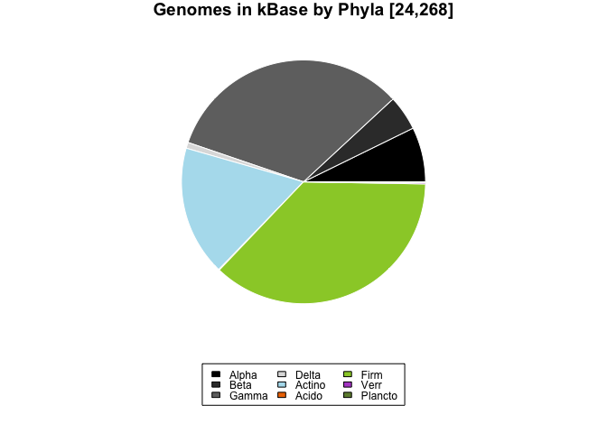<!-- -->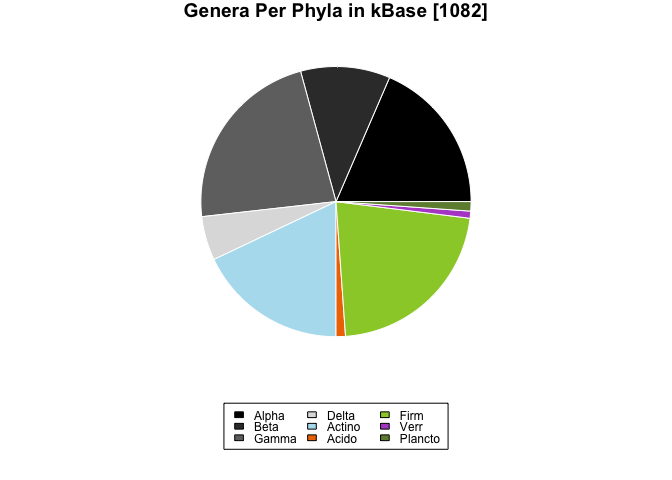<!-- -->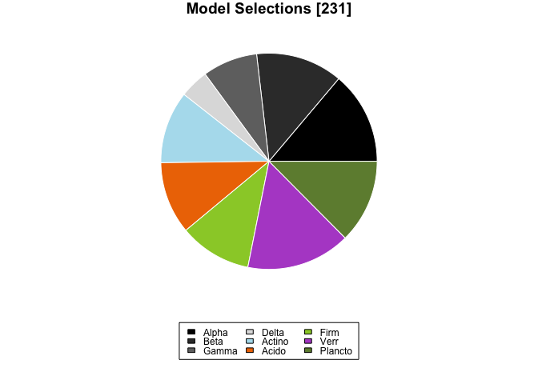<!-- -->

```
## null device 
##           1
```

A database of exchange reactions was built to represent the full range of metabolites possible for uptake across all models. Number of C atoms and Gibbs free energy were noted for each metabolite. Models were compared for similarity of exchange reaction identity using MDS ordination.


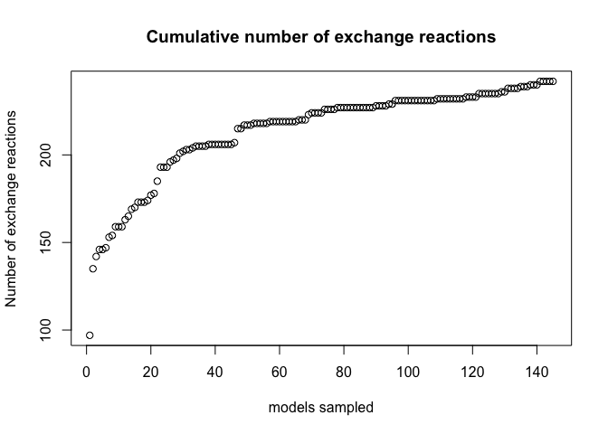<!-- -->

```
## Run 0 stress 0.193728 
## Run 1 stress 0.2019923 
## Run 2 stress 0.2451109 
## Run 3 stress 0.1975391 
## Run 4 stress 0.1965123 
## Run 5 stress 0.1965028 
## Run 6 stress 0.1944349 
## Run 7 stress 0.1961238 
## Run 8 stress 0.1963955 
## Run 9 stress 0.2001101 
## Run 10 stress 0.2273564 
## Run 11 stress 0.1988808 
## Run 12 stress 0.1965047 
## Run 13 stress 0.1927785 
## ... New best solution
## ... procrustes: rmse 0.02993125  max resid 0.1858318 
## Run 14 stress 0.2156187 
## Run 15 stress 0.1927786 
## ... procrustes: rmse 0.0002827015  max resid 0.001406908 
## *** Solution reached
```

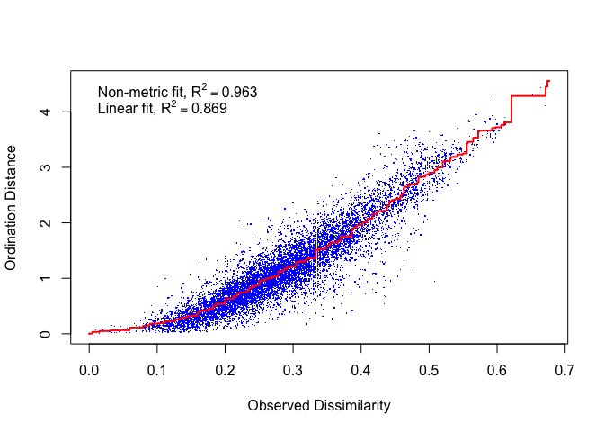<!-- -->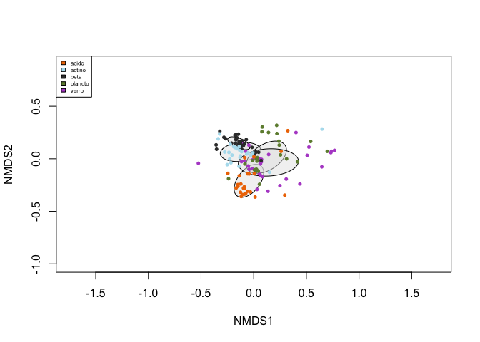<!-- -->


#**CARBON USE EFFICIENCY**

**CUE=(Net C Uptake - Respiration)/(Total C Uptake)**

Carbon use efficiency was explored under two scenarios. (1) Unconstrained CUE was calculated by allowing a model to utilize all exchange reactions present, and (2) Constrained CUE was calculated by limiting the availability of a single constraining C-containing metabolite while leaving all other unconstrained.


##**UNCONSTRAINED CUE**

Unconstrained CUE ranged from 0.077259 to 0.916791.

<!-- -->


###**Phylogenetic Analyses**

Unconstrained CUE was analyzed for a phylogenetic signal.
K values of 1 correspond to a Brownian motion process, which implies some degree of phylogenetic signal or conservatism. K values closer to zero correspond to a random or convergent pattern of evolution, while K values greater than 1 indicate strong phylogenetic signal and conservatism of traits. 

Unconstrained CUE was found to have a significant phylogenetic signal with a K of 0.03.

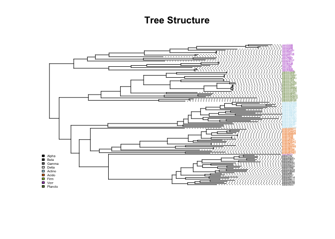<!-- -->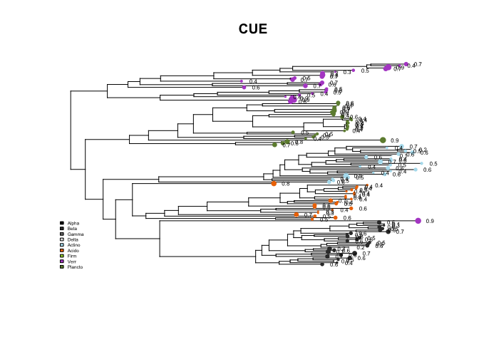<!-- -->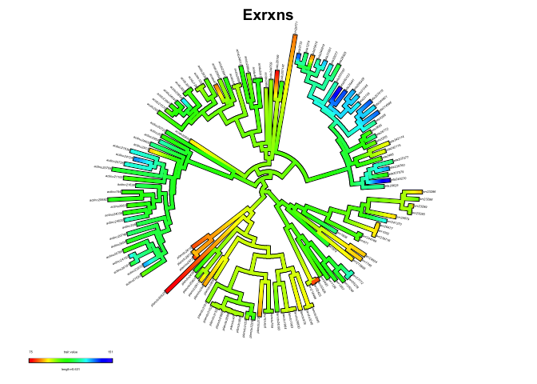<!-- -->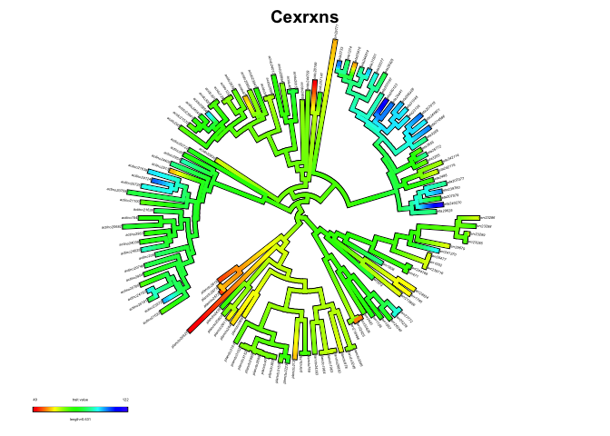<!-- -->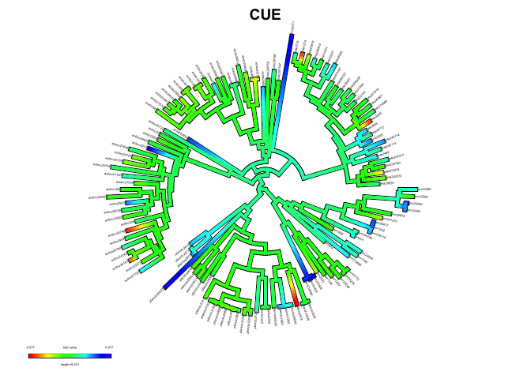<!-- -->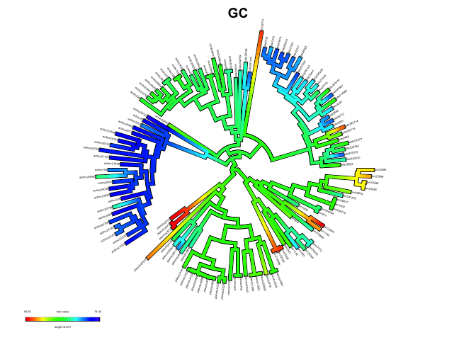<!-- -->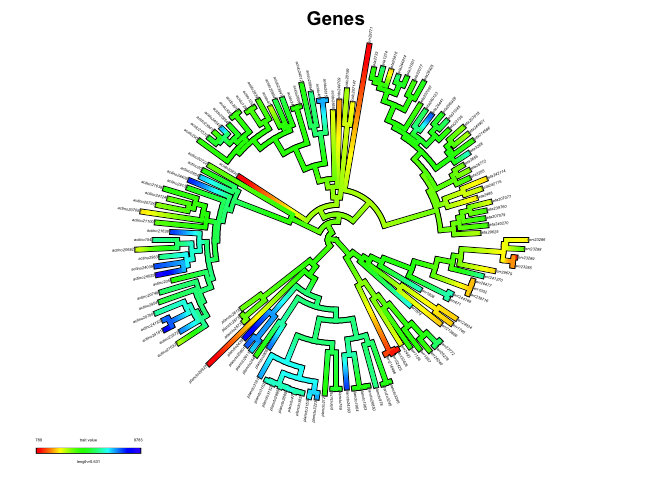<!-- -->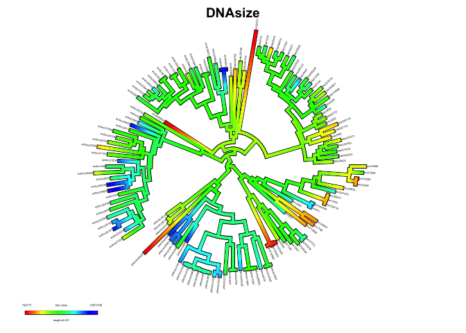<!-- -->

                   K   PIC.variance.obs   PIC.variance.rnd.mean   PIC.variance.P   PIC.variance.Z
--------  ----------  -----------------  ----------------------  ---------------  ---------------
Exrxns     0.1640496       2.051194e+03            3.675441e+04            0.001       -2.5978114
Cexrxns    0.1725261       1.635154e+03            3.053349e+04            0.001       -2.4517040
CUE        0.0377776       9.143651e-01            3.867958e+00            0.003       -1.9129813
GC         1.2898714       7.349652e+01            9.937818e+03            0.001       -2.7610179
Contigs    0.1758305       4.540426e+06            9.772973e+07            0.005       -0.7168634
Genes      0.3146108       1.591306e+07            5.730159e+08            0.001       -2.7242516
DNAsize    0.5020087       1.307122e+13            7.451018e+14            0.001       -2.7606649


Phylogenetic Independent Contrasts were used to test for relationships between CUE and genome traits.

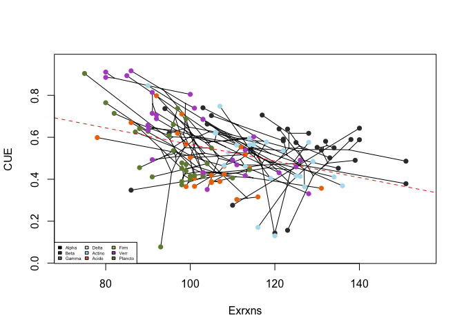<!-- -->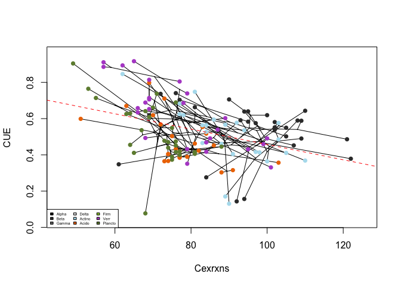<!-- -->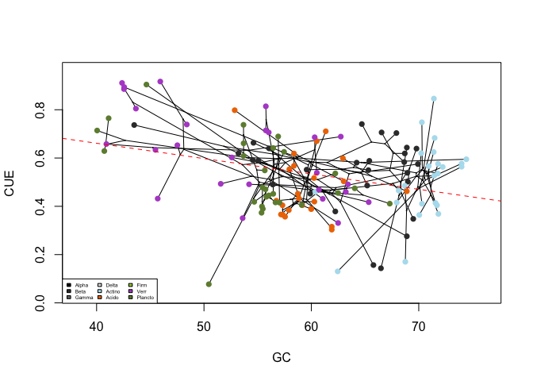<!-- -->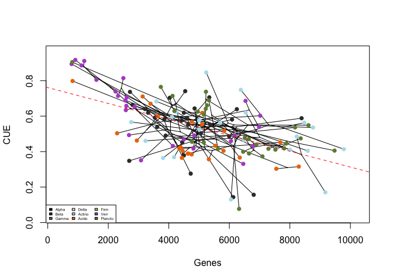<!-- -->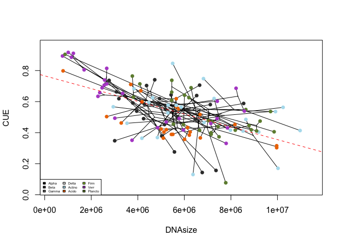<!-- -->

           Intercept        Slope       R-Adj
--------  ----------  -----------  ----------
Exrxns     0.9608944   -0.0039505   0.1457687
Cexrxns    0.8801619   -0.0042273   0.1393639
GC         0.9156732   -0.0063604   0.0995834
Genes      0.7608438   -0.0000448   0.2943128
DNAsize    0.7659457    0.0000000   0.3229883

##**CONSTRAINED CUE**

For each model in the unconstrained environment, C-containing exchange reactions were classified according to the following hierarchy:

(1) *Utilized*: reactions utilized by the model in the unconstrained environment.

>(2) *Essential*: reactions that are required for biomass production, identified as reactions that result in no biomass production when availability is set to zero.

>>(3) *Constraining*: reactions that biomass production responds to the availability of, i.e. reactions needed at more than a low threshold. 

The uptake kinetics of the most common *constraining* reactions across models were analyzed. The availability of *constraining* reactions was then set to the concentration resulting in (a) 1/2 and (b) 1/4 of maximum biomass and CUE was recalculated.

### Uptake Kinetics

**Km and Vmax for Constraining Lists**
*Fitting MM Models to Kinetics Data*

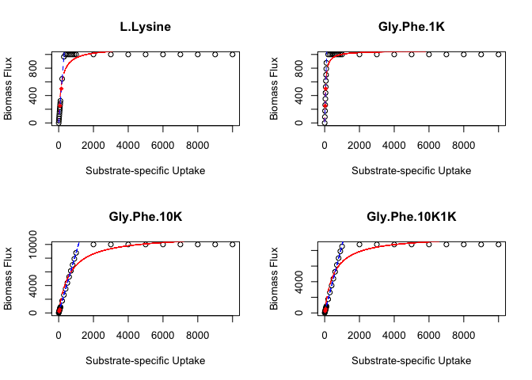<!-- --><!-- -->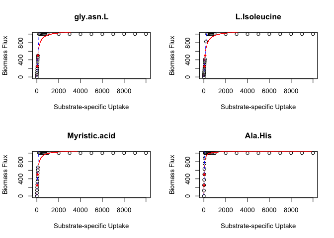<!-- --><!-- --><!-- -->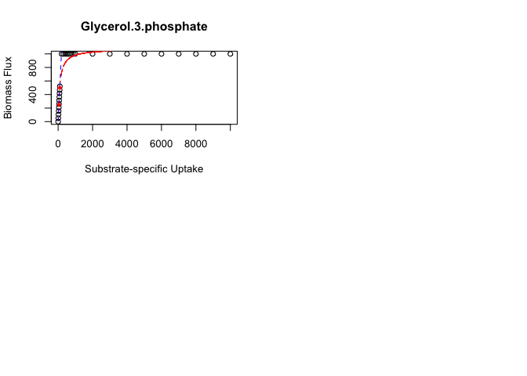<!-- -->

                 uptake       L.Lysine     Gly.Phe.1K    Gly.Phe.10K   Gly.Phe.10K1K          ocdca         TRHL        Gly.Tyr         ddca     gly.asn.L   L.Isoleucine   Myristic.acid        Ala.His   L.Phenylalanine   L.Arginine   L.Tyrosine    D.Arabinose       Cytidine       L.Valine     L.Proline    L.Histidine   Glycerol.3.phosphate
--------------  -------  -------------  -------------  -------------  --------------  -------------  -----------  -------------  -----------  ------------  -------------  --------------  -------------  ----------------  -----------  -----------  -------------  -------------  -------------  ------------  -------------  ---------------------
Km                   NA    155.1838328     50.4380138   6.378709e+02      514.564269     30.9441102     58.63531     28.0279135     58.63531    103.470412     125.531434      75.7168209     27.6516428        78.5264815     99.88237     55.45183     25.5975707    128.4957229    173.4981942    102.244632     27.6516428              99.045680
Vm                   NA   1097.0794735   1053.1013772   1.136925e+04     9876.940300   1047.5678450   1056.66670   1046.9682062   1056.66670   1079.640287    1087.261558    1065.2770580   1046.8203125      1066.7497918   1077.89557   1055.20884   1046.0672293   1088.3203816   1100.9812684   1078.429742   1046.8203125            1077.465721
lm-intercept         NA     -0.0000267      0.0000045   1.444028e-01       12.425781     -0.0000044      0.00000      0.0000044      0.00000      0.000014      -0.000027      -0.0000045     -0.0000167         0.0000091      0.00000      0.00000     -0.0000167      0.0000054     -0.0000076      9.087836     -0.0000167               0.000000
lm-slope             NA      3.2211451      8.7803970   8.779215e+00        8.695916     11.7392473      7.99661     12.4926327      7.99661      4.979316       4.135675       6.6638419     12.6161319         6.4716755      5.17069      8.28661     13.3276840      4.0328230      2.8390284      4.875667     12.6161319               5.217443
uptake at 500        NA    155.2243107     56.9450328   5.693625e+01       56.069331     42.5921688     62.52650     40.0235890     62.52650    100.415406     120.899252      75.0317927     39.6318000        77.2597443     96.69889     60.33830     37.5158966    123.9826288    176.1165937    100.686157     39.6318000              95.832379
uptake at 250        NA     77.6121595     28.4725162   2.845990e+01       27.320205     21.2960846     31.26325     20.0117943     31.26325     50.207701      60.449629      37.5158967     19.8159007        38.6298715     48.34945     30.16915     18.7579489     61.9913137     88.0582982     49.411121     19.8159007              47.916189


### Constraint Effect Size 
Constrained CUE was reduced relative to unconstrained CUE, but the effect size varied by metabolite.

<!-- --><!-- -->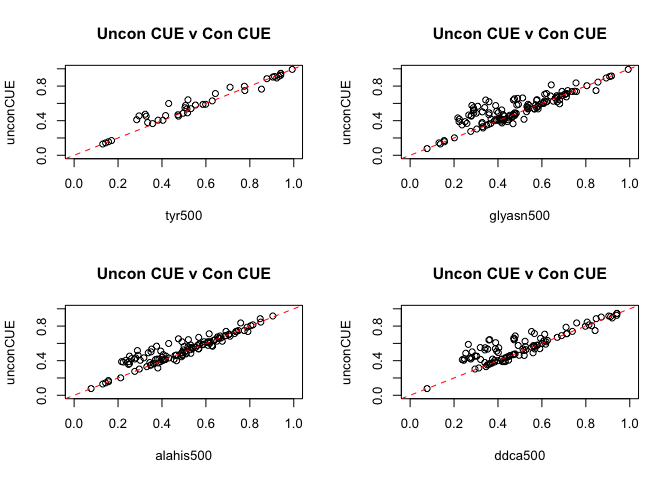<!-- -->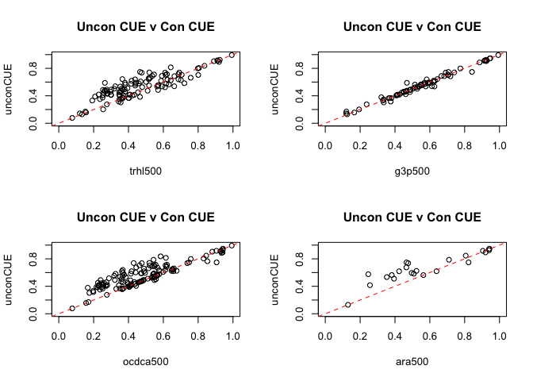<!-- -->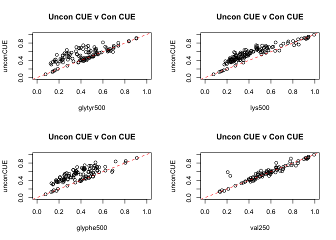<!-- --><!-- -->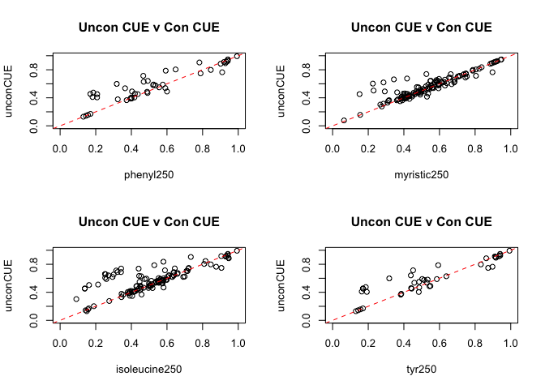<!-- -->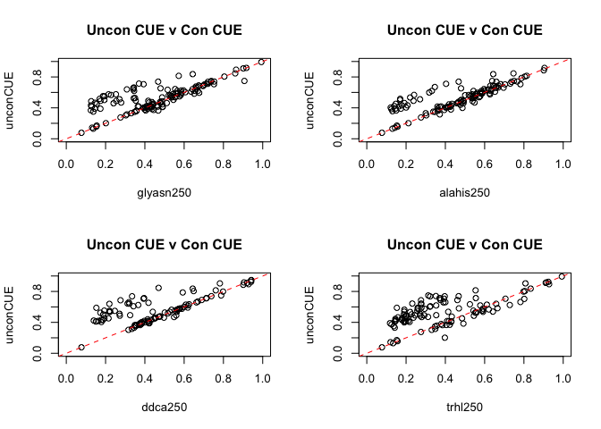<!-- --><!-- -->

                 Cohens D   Paired T-test Pval
--------------  ---------  -------------------
his500              0.187                0.228
cyt500              0.393                0.007
pro500              0.104                0.331
arg500              0.298                0.001
phenyl500           0.324                0.033
myristic500         0.302                0.001
isoleucine500       0.412                0.000
tyr500              0.461                0.005
glyasn500           0.505                0.000
alahis500           0.458                0.000
ddca500             0.593                0.000
trhl500             0.710                0.000
g3p500              0.000                1.000
ocdca500            0.793                0.000
ara500              0.855                0.000
glytyr500           0.809                0.000
lys500              1.576                0.000
glyphe500           1.330                0.000
val250              0.164                0.117
his250              0.211                0.174
cyt250              0.534                0.000
pro250              0.068                0.528
arg250              0.335                0.000
phenyl250           0.509                0.001
myristic250         0.267                0.003
isoleucine250       0.442                0.000
tyr250              0.429                0.009
glyasn250           0.536                0.000
alahis250           0.526                0.000
ddca250             0.672                0.000
trhl250             0.894                0.000
g3p250              0.000                0.997
ocdca250            0.886                0.000
ara250              1.176                0.000
glytyr250           0.891                0.000
lys250              1.875                0.000
glyphe250           1.408                0.000

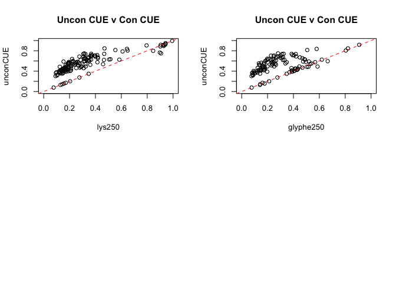<!-- -->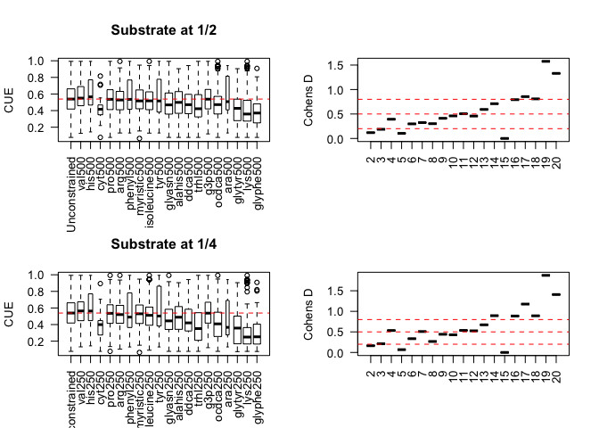<!-- -->

